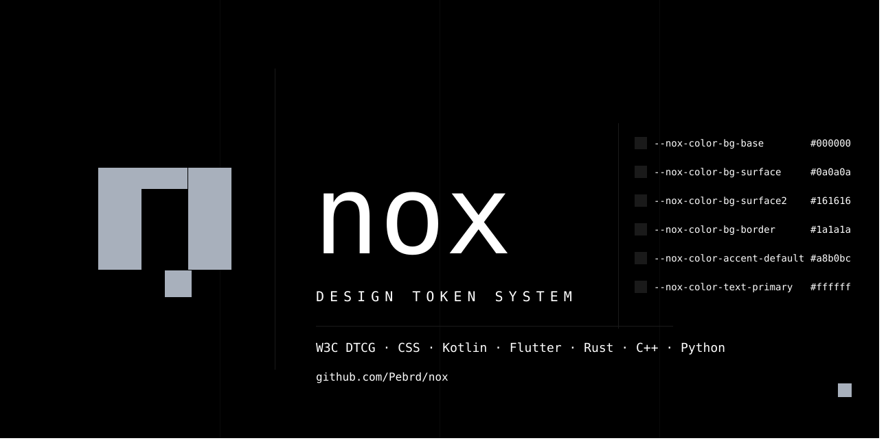

<p align="center">
  
</p>

Design tokens en formato **W3C DTCG** generados automáticamente para todas las plataformas mediante Style Dictionary v4.

## Filosofía

- Negro puro como base (`#000000`)
- Jerarquía por valor de fondo (4 pasos: `#000` → `#0A0A0A` → `#161616` → `#1A1A1A`)
- Cero border-radius — brutalista, sin redondeos
- Bordes de 1dp definen la profundidad (sin sombras)
- Acento configurable en runtime (`#A8B0BC` por defecto)

---
## Uses
- [VOID](https://github.com/welcomethevoid)
- [LUMO](https://github.com/pebrd/lumo)
- [CONDUIT](https://github.com/pebrd/conduit)
- [NOX-DOTS](https://github.com/pebrd/nox-dots)


Default message

```
## 🎨 Design System & Aesthetics (Nox)

Conduit's premium interface is dynamically synchronized with the **Nox Design System** (defined in [pebrd/nox](https://github.com/pebrd/nox)). The application is designed to follow a high-contrast monochromatic brutalist style:

- **⚫ AMOLED Absolute Black**: Sleek energy-saving dark palette (`ColorBgBase`, `ColorBgSurface`, `ColorBgSurface2` mapped straight from `NoxTokens`).
- **📐 Flat Brutalist Shapes**: No rounded corners (`0.dp` border radius) for a technical, command-line inspired layout.
- **🅰️ Custom Google Fonts**: Fully integrated with **IBM Plex Sans** (Light, Regular, SemiBold) for displays and bodies, and **IBM Plex Mono** (Light, Regular) for tags, track IDs, ISRCs, scores, and logs.
```
  
---

## Estructura

```
void-tokens/
├── tokens/                  ← Fuente de verdad (W3C DTCG)
│   ├── color.json
│   ├── spacing.json
│   ├── typography.json
│   ├── border.json
│   └── effect.json
├── dist/                    ← Auto-generado por la Action, no editar
│   ├── css/void-tokens.css
│   ├── js/void-tokens.mjs
│   ├── ts/void-tokens.d.ts
│   ├── android/
│   │   ├── void_colors.xml
│   │   └── void_dimens.xml
│   ├── kotlin/VoidTokens.kt
│   ├── flutter/void_tokens.dart
│   ├── rust/void_tokens.rs
│   ├── cpp/void_tokens.hpp
│   └── python/void_tokens.py
├── style-dictionary.config.mjs
├── package.json
└── .github/workflows/build-tokens.yml
```

---

## Cómo actualizar tokens

1. Editá los archivos en `tokens/` (nunca en `dist/`)
2. Hacé push a `main`
3. La GitHub Action corre, genera todos los outputs y los commitea en `dist/`

### Localmente

```bash
npm install
npm run build
```

---

## Cómo usar en cada proyecto

### CSS / React / Web
```css
@import url('https://raw.githubusercontent.com/TU_USER/void-tokens/main/dist/css/void-tokens.css');

.card {
  background: var(--void-color-bg-surface);
  border: 1px solid var(--void-color-bg-border);
  color: var(--void-color-text-primary);
}
```

### Kotlin / Jetpack Compose
Copiá `dist/kotlin/VoidTokens.kt` a tu módulo `core/ui/theme/` o agregalo como submódulo de Git.

```kotlin
import void.designsystem.VoidTokens

val colorScheme = darkColorScheme(
    background = VoidTokens.ColorBgBase,
    surface    = VoidTokens.ColorBgSurface,
    primary    = accentColor,
    error      = VoidTokens.ColorSemanticDanger,
)
```

### Flutter / Dart
```dart
import 'void_tokens.dart';

Container(
  color: VoidTokens.colorBgSurface,
  padding: EdgeInsets.all(VoidTokens.spacingMd),
)
```

### Rust
```rust
use void_tokens::void_tokens::*;

let bg: u32 = COLOR_BG_BASE; // 0x000000
```

### C++
```cpp
#include "void_tokens.hpp"

uint32_t bg = void_tokens::COLOR_BG_BASE;
```

### Python
```python
from void_tokens import VoidTokens

bg = VoidTokens.COLOR_BG_BASE  # "#000000"
```

---

## Formato de tokens (W3C DTCG)

Cada token sigue el estándar del [W3C Design Token Community Group](https://tr.designtokens.org/format/):

```json
{
  "color": {
    "bg": {
      "base": {
        "$value": "#000000",
        "$type": "color",
        "$description": "App background."
      }
    }
  }
}
```

Tipos soportados: `color`, `dimension`, `fontFamily`, `fontWeight`, `number`.
